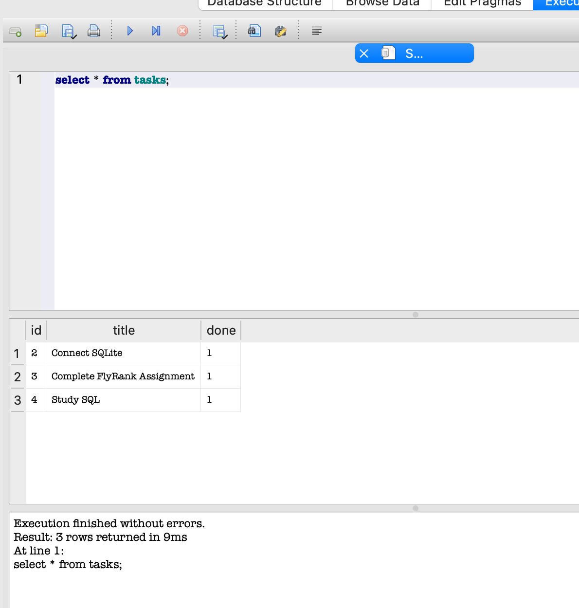

# FlyRank CRUD API with SQLite

A RESTful Task Management API built using **FastAPI** and **SQLite** as part of the FlyRank Backend Engineering Internship (Week 3 Assignment).

## Features

- Create a task
- Read all tasks
- Read a task by ID
- Update a task
- Delete a task
- Persistent SQLite database
- Automatic database and table creation
- Automatic seed data
- Parameterized SQL queries

---

# Why SQLite?

SQLite was chosen because:

- It is lightweight.
- It requires zero configuration.
- The database is stored in a single file (`tasks.db`).
- Data persists after restarting the application.

---

# Tech Stack

- Python 3
- FastAPI
- SQLite
- Uvicorn

---

# Project Structure

```text
flyrank-crud-api-task
│
├── app
│   ├── main.py
│   ├── database.py
│   └── tasks.db (created automatically)
│
├── images
│   └── database.png
│   └── swagger-ui.png
│
├── requirements.txt
├── README.md
└── .gitignore
```

---

# Installation

Clone the repository

```bash
git clone https://github.com/lucky1405/flyrank-crud-api-task.git
```

Go inside the project

```bash
cd flyrank_crud_api_task
```

Create a virtual environment

```bash
python3 -m venv virtual
```

Activate it

macOS/Linux

```bash
source virtual/bin/activate
```

Install dependencies

```bash
pip install -r requirements.txt
```

Run the application

```bash
uvicorn app.main:app --reload
```

The application automatically:

- Creates `tasks.db`
- Creates the `tasks` table
- Inserts three sample tasks (only on the first run)

---

# API Endpoints

| Method | Endpoint | Description |
|--------|----------|-------------|
| GET | `/tasks` | Get all tasks |
| GET | `/tasks/{id}` | Get a task by ID |
| POST | `/tasks` | Create a task |
| PUT | `/tasks/{id}` | Update a task |
| DELETE | `/tasks/{id}` | Delete a task |

---

# Example SQL Query

```sql
SELECT * FROM tasks;
```

This query returns all tasks stored in the SQLite database.

---

# Database Screenshot



---

# Future Improvements

- Search tasks using SQL `LIKE`
- Filter tasks by completion status
- Sort tasks alphabetically
- Add timestamps (`created_at`, `updated_at`)
- Add pagination

---

## Running PostgreSQL

```bash
docker run --name taskdb \
-e POSTGRES_PASSWORD=dev \
-e POSTGRES_DB=tasks \
-p 5432:5432 \
-v taskdata:/var/lib/postgresql/data \
-d postgres
```

---

# Author

Lucky