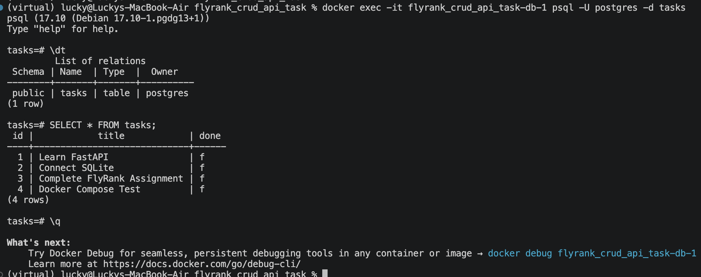
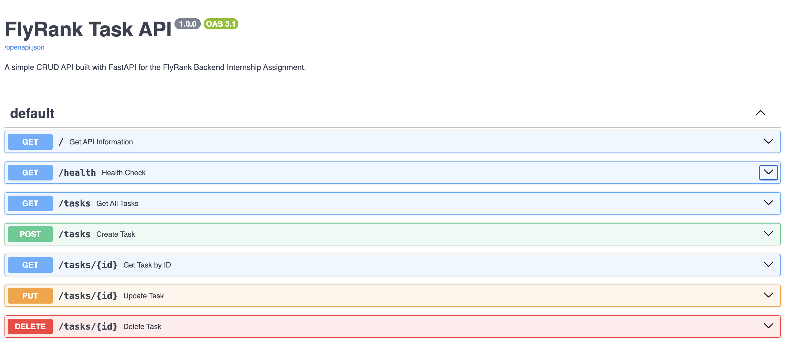

# FlyRank CRUD API

A RESTful Task Management API built using **FastAPI**, **PostgreSQL**, and **Docker Compose** as part of the FlyRank Backend Engineering Internship Assignment.

---

## Features

- RESTful CRUD API
- FastAPI
- PostgreSQL 17
- Docker & Docker Compose
- Automatic database initialization
- Seed data on first startup
- Parameterized SQL queries
- Persistent PostgreSQL volume

---

# Tech Stack

- Python 3.13
- FastAPI
- PostgreSQL 17
- psycopg
- Docker
- Docker Compose

---

# Project Structure

```text
flyrank_crud_api_task/
│
├── app/
│   ├── main.py
│   ├── database.py
│
├── images/
│   ├── database.png
│   └── swagger-ui.png
|   └── databases.png
│
├── Dockerfile
├── docker-compose.yml
├── requirements.txt
├── .env.example
├── README.md
└── .gitignore
```

---

# Getting Started

Clone the repository

```bash
git clone https://github.com/lucky1405/flyrank-crud-api-task.git
cd flyrank_crud_api_task
```

Create the environment file

```bash
cp .env.example .env
```

Start the complete application

```bash
docker compose up --build
```

The API will be available at:

```
http://localhost:8000
```

Swagger UI:

```
http://localhost:8000/docs
```

---

# Environment Variables

Create a `.env` file from `.env.example`.

```
DATABASE_URL=postgresql://postgres:dev@db:5432/tasks
```

---

# API Endpoints

| Method | Endpoint | Description |
|--------|----------|-------------|
| GET | `/` | API information |
| GET | `/health` | Health check |
| GET | `/tasks` | Get all tasks |
| GET | `/tasks/{id}` | Get task by ID |
| POST | `/tasks` | Create a task |
| PUT | `/tasks/{id}` | Update a task |
| DELETE | `/tasks/{id}` | Delete a task |

---

# Example API Request

Create a task

```bash
curl -X POST http://localhost:8000/tasks \
-H "Content-Type: application/json" \
-d '{"title":"Learn Docker"}'
```

Example response

```json
{
    "id": 4,
    "title": "Learn Docker",
    "done": false
}
```

---

# Docker Commands

Start the application

```bash
docker compose up --build
```

Stop the application

```bash
docker compose down
```

---

# Persistence

The PostgreSQL database is stored in a Docker volume.

Even after running

```bash
docker compose down
```

your tasks remain available when you start the application again.

---

# Database Screenshot



---

# Swagger UI



---

# Database Verification

Inside the PostgreSQL container

```bash
docker exec -it flyrank_crud_api_task-db-1 psql -U postgres -d tasks
```

List tables

```sql
\dt
```

View tasks

```sql
SELECT * FROM tasks;
```

---

# Future Improvements

- Authentication
- Pagination
- Search
- Task categories
- User accounts
- JWT Authentication

---

# Author

Lucky